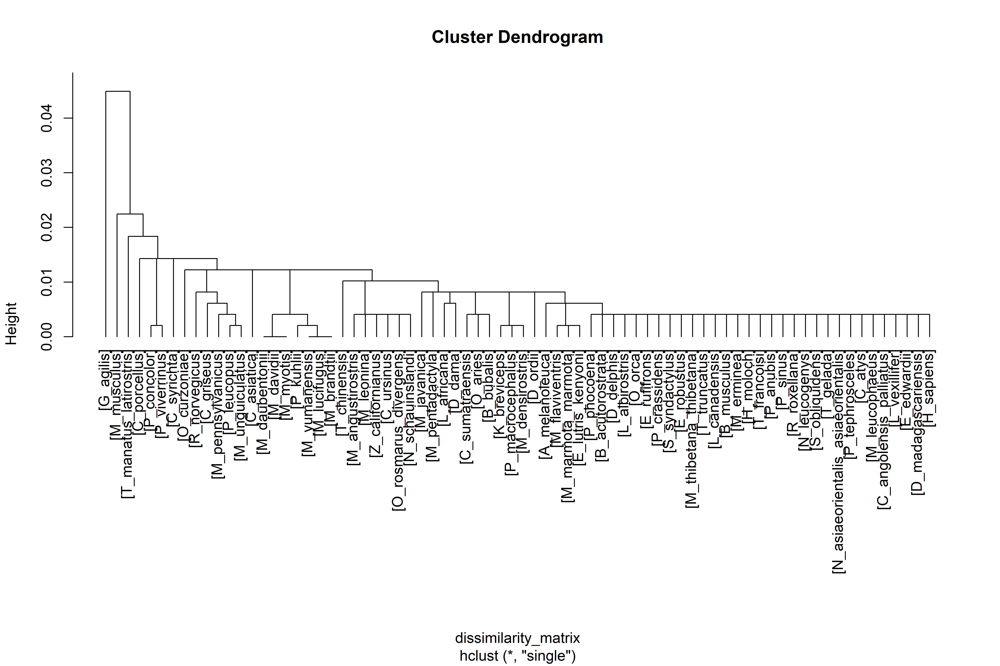
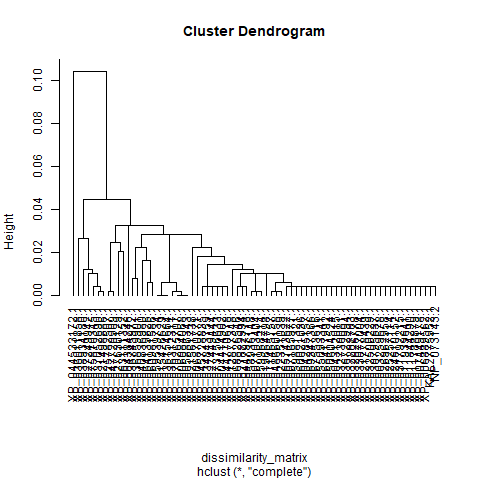
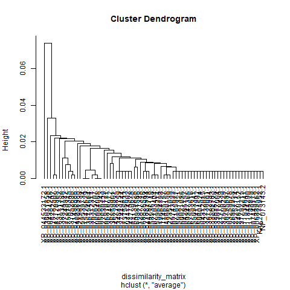
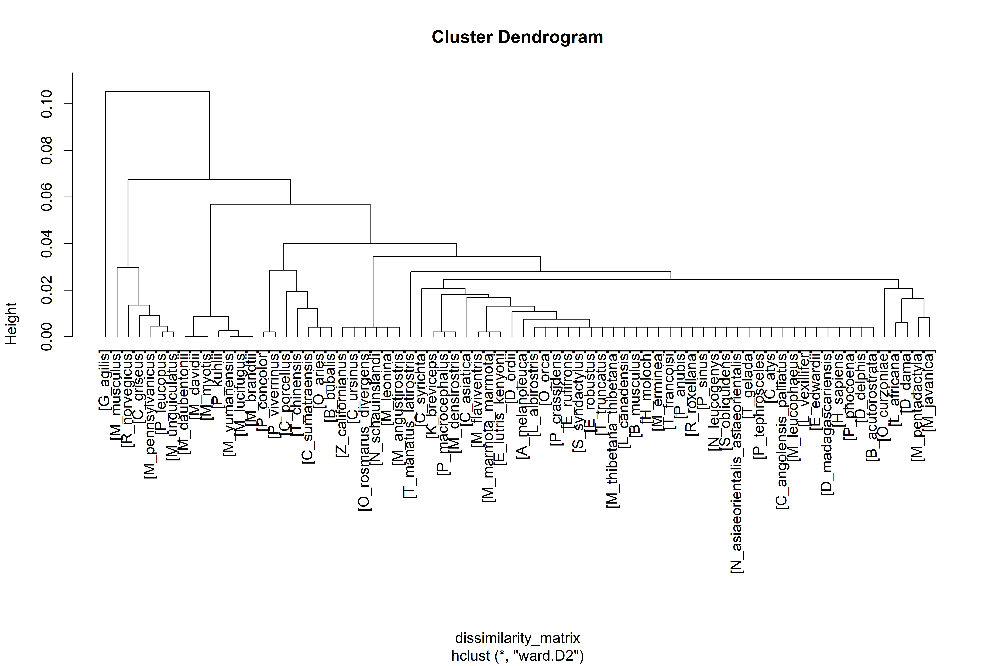

# Introducción al Análisis de Clustering 

Este proyecto tiene como objetivo explorar las relaciones evolutivas y funcionales entre un conjunto de secuencias de proteínas mediante técnicas de clustering jerárquico. El análisis parte de resultados de alineamiento de secuencias (BLASTP) para construir dendogramas que representen la estructura de los datos.

A continuación, se describen las consideraciones más importantes que deben tomarse en cuenta al interpretar los resultados generados en la carpeta [`results/`](../results/).

## Consideraciones Clave en el Análisis

### 1. Definición de la Métrica de Distancia
El paso fundamental en cualquier análisis de clustering es definir cómo se mide la "similitud" o "distancia" entre dos elementos.
*   **Origen de los datos:** Se utilizaron *bitscores* provenientes de un análisis BLASTP "all-vs-all". El *bitscore* es una medida de similitud de secuencia que es independiente del tamaño de la base de datos, lo que lo hace adecuado para comparaciones por pares.
*   **Normalización Global:** Para convertir estos puntajes en distancias utilizables ($0$ a $1$), los *bitscores* fueron normalizados dividiéndolos por el *bitscore* máximo observado fuera de la diagonal (la mayor similitud entre dos proteínas distintas).
*   **Conversión a Disimilitud:** La matriz de similitud normalizada ($S$) se transformó en una matriz de disimilitud ($D$) mediante la fórmula $D = 1 - S$.
    *   **Interpretación:** Un valor cercano a $0$ indica secuencias muy similares (alta homología), mientras que un valor cercano a $1$ indica secuencias muy divergentes.

### 2. Impacto del Método de Agrupamiento (Linkage)
Se aplicaron cuatro métodos de aglomeración jerárquica distintos (`single`, `complete`, `average`, `ward.D2`). Es crucial notar que **no existe un "único árbol verdadero"** en clustering exploratorio, cada método revela diferentes aspectos de la estructura de los datos:

*   **Single Linkage (Vecino más cercano):** Define la distancia entre clústeres como la distancia más corta entre cualquiera de sus miembros.
    *   *Tendencia:* Propenso al efecto de "encadenamiento" (*chaining*), donde clústeres distintos se fusionan debido a un solo par de elementos cercanos. Genera árboles extendidos y desbalanceados.
*   **Complete Linkage (Vecino más lejano):** Utiliza la distancia máxima entre miembros de clústeres.
    *   *Tendencia:* Busca clústeres compactos y esféricos. Es más sensible a *outliers* pero evita el encadenamiento.
*   **Average Linkage (UPGMA):** Utiliza el promedio de todas las distancias entre pares de los dos clústeres.
    *   *Importancia:* A menudo se prefiere en filogenética porque asumen una tasa evolutiva constante (reloj molecular) y ofrece un compromiso entre la sensibilidad del *single* y la rigidez del *complete*.
*   **Ward's Method (Ward.D2):** Minimiza la varianza total dentro de los clústeres.
    *   *Tendencia:* Genera clústeres muy compactos y de tamaños similares. Es útil para separar grupos bien definidos, aunque puede forzar una estructura esférica incluso si no existe.

### 3. Interpretación de los Resultados ([`results/`](../results/))
*   **Comparación de Topologías:** Al observar los archivos [`.tree`](../results) (visualizables en herramientas como FigTree o iTOL), se debe prestar atención a cómo cambia la agrupación de las mismas proteínas bajo diferentes métodos. Si un grupo se mantiene constante en los cuatro métodos (Average, Complete, Single, Ward), existe una **fuerte evidencia** de que esas proteínas están verdaderamente relacionadas biológicamente.
*   **Cophrenetic Correlation:** Para validar qué árbol representa mejor los datos originales, se puede calcular la correlación cofenética (comparar las distancias en el árbol vs. la matriz de distancia original). Usualmente, el método *Average* preserva mejor las distancias originales.

Este análisis permite identificar subfamilias proteicas y entender su divergencia evolutiva basada puramente en la similitud de secuencia.

### 4. Análisis Visual y Discusión de los Dendrogramas

A continuación, se presentan los dendrogramas generados por los cuatro métodos de clustering. La inspección visual permite evaluar la "calidad" de la estructura recuperada y responder preguntas sobre la informatividad y congruencia biológica.

#### 4.1 Visualización de los Árboles

| Método | Dendrograma | Características Visuales |
| :--- | :---: | :---: |
| **Single Linkage** |  | Tendencia a formar "escaleras" o cadenas largas. |
| **Complete Linkage** |  | Estructura más balanceada y compacta. |
| **Average Linkage** |  | Compromiso entre single y complete. |
| **Ward's Method** |  | Clústeres muy definidos y compactos. |

#### 4.2 Discusión de Resultados

1.  **¿Cuál es el árbol más informativo?**
    *   **Average Linkage (Plot 03) y Ward.D2 (Plot 04)** suelen ser los más informativos.
    *   La razón es que el método **Average** (UPGMA) es estándar en filogenética molecular porque asume implícitamente un "reloj molecular" y promedia las distancias (aunque para este campo hay mejores métodos como HYK que aplican otro enfoque pero retornan mejores resultados), reflejando mejor las relaciones entre grupos. **Ward** es excelente para definir grupos discretos (familias/subfamilias claras) al minimizar la varianza interna, facilitando la identificación de clases funcionales distintas.
    *   En este caso árbol `Ward` es muy útil para *clasificación*, muestra grupos claros y más agrupados que coinciden con familias conocidas.

2.  **¿Cuál es el árbol menos informativo?**
    *   **Single Linkage (Plot 01)**.
    *   *Razón:* Este método sufre fuertemente del efecto de **"encadenamiento"** (chaining). En lugar de recuperar clados o familias distintas, tiende a añadir secuencias una por una a un grupo creciente, formando una estructura de "escalera" que no refleja la verdadera historia evolutiva ni la estructura funcional de las proteínas. Visualmente, se ve como una línea diagonal larga con pocas ramas "profundas" que separen grupos grandes.

3.  **¿Cuántos árboles son congruentes con la taxonomía de las proteínas?**
    *   *Evaluación:* Para responder esto con precisión, se deben cotejar los clusters con la anotación taxonómica o funcional de las proteínas (nombres en las hojas del árbol).
    *   **Tendencia General:**
        *   **Average y Ward** suelen ser los más congruentes con la taxonomía clásica, ya que agrupan secuencias basándose en similitud global y minimización de varianza, lo cual se alinea con la divergencia evolutiva de familias.
        *   **Complete** puede ser congruente pero a veces fuerza grupos artificiales.
        *   **Single** raramente es congruente estructuralmente debido al encadenamiento.
    *   *Conclusión:* Probablemente **2 de los 4 árboles** (Average y Ward) muestren una alta congruencia con la taxonomía esperada. Si `Complete` también recupera los mismos grupos principales, serían **3**. Single suele fallar en recuperar la jerarquía taxonómica de alto nivel.
